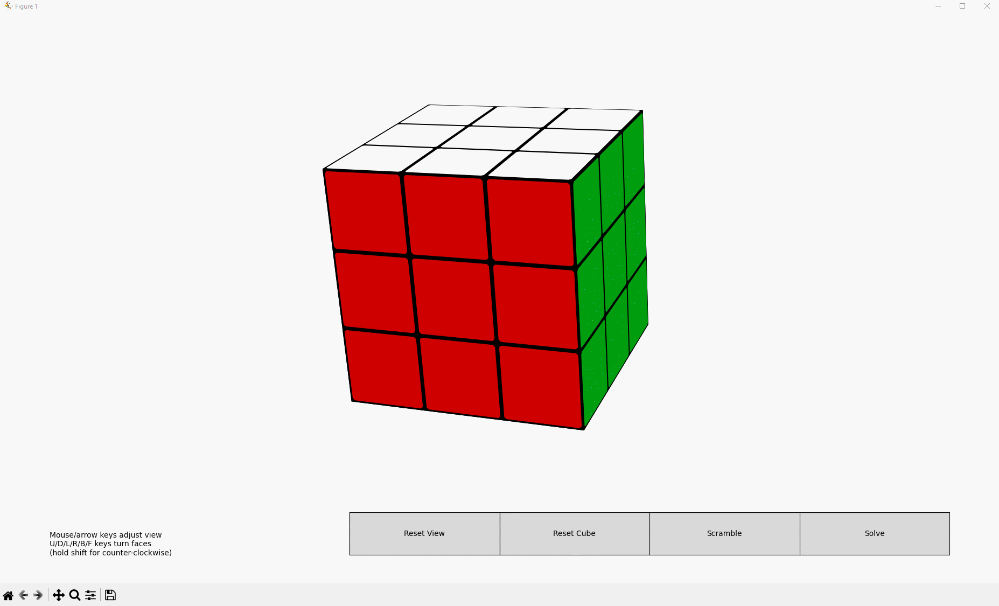

# RubikSolver
Rubik's cube Solver made for the Intelligent Systems course.

**Authors:**
- Miguel Luna García (alu0101448251@ull.edu.es)
- Kilian González Rodríguez (alu0101222325@ull.edu.es)
- Jakob Guttmann (alu0101685854@ull.edu.es)


## Usage

- Install dependencies:
```bash
pip install -r requirements.txt
```

- Execute the program:
```bash
python src/cube_interactive.py
```


## Instructions

- Rotate the cube by clicking and dragging the mouse, or with the arrow keys.
- Rotate each face clockwise with the corresponding <kbd>key</kbd>, and counter-clockwise with <kbd>⇧ Shift</kbd> + <kbd>key</kbd>:
    - `U`: Up
    - `D`: Down
    - `L`: Left
    - `R`: Right
    - `F`: Front
    - `B`: Back


## Demo


